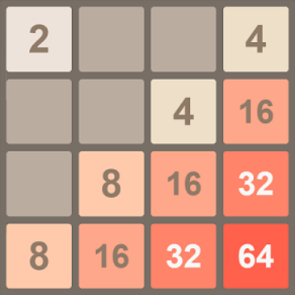

# 2048 Game Simulator

This repository contains the implementation of the popular sliding tile puzzle game 2048 in Java. This project was developed as part of the Programming 2 course at Saarland University.

## Overview

2048 is a single-player sliding tile puzzle game. The objective is to slide numbered tiles on a grid to combine them and create a tile with the number 2048.

 <!-- Replace with an actual image link if available -->

## Features

- **Game Logic**: Implements the core mechanics of 2048, including tile sliding and merging.
- **Graphical User Interface (GUI)**: Play the game using a simple GUI.
- **Command-Line Interface (CLI)**: Configure and play the game via command-line options.
- **Automated Tests**: Includes tests to verify the correctness of the game logic.
- **Bonus**: An AI player that attempts to win the game.

